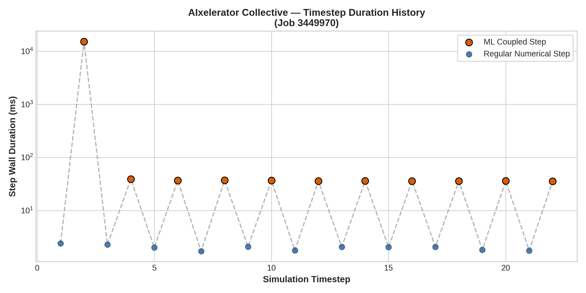
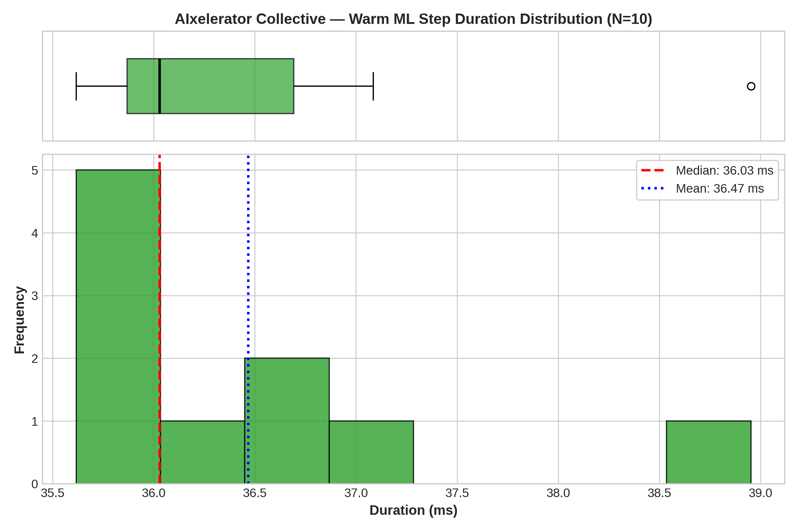
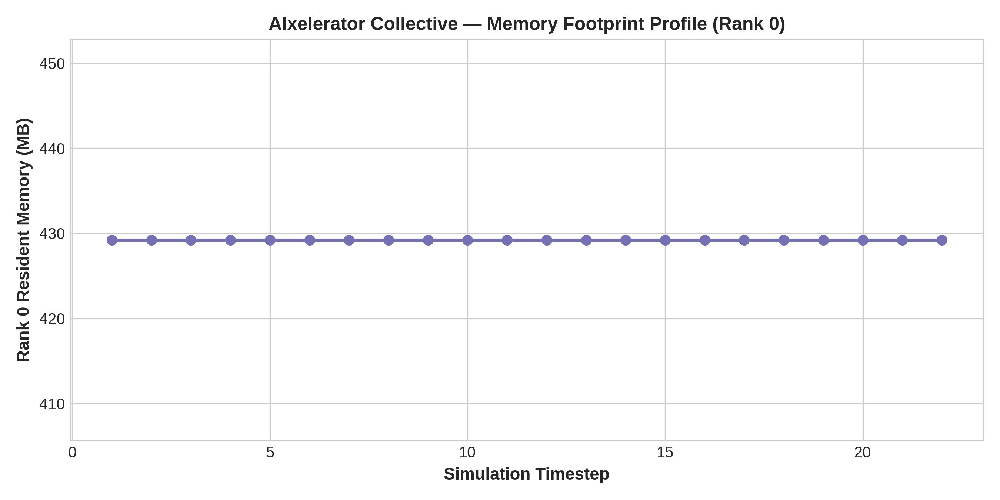

# Configuration Analysis: AIxelerator Collective

- **Framework / Provider**: `AIX`
- **Slurm Job ID**: `3449970`
- **Hardware Environment**: CLAIX-23 Heterogeneous (1x c23mm CPU Node with 24 Ranks + 1x c23g GPU Node with 1x NVIDIA H100)
- **Workload**: WaterCNN ($1920 \times 1080$, 22 timesteps)

## 1. Timestep Timing Statistics

| Metric | Duration (ms) |
|---|---|
| **Cold Start ML Step (Step 1)** | 15172.40 ms |
| **Warm ML Step Median** | **36.03 ms** |
| **Warm ML Step IQR** | 0.82 ms |
| **Warm ML Step Mean** | 36.47 ms |
| **Warm ML Step StdDev** | 0.99 ms |
| **Warm ML Step 95th Percentile** | 38.11 ms |
| **Regular Numerical Step Avg** | 2.00 ms |
| **Total Simulation Solve Time** | 65.0 s |

## 2. Resource Utilization

| Metric | Value |
|---|---|
| **Peak RSS (Max Rank)** | 1017.5 MB |
| **Peak RSS (Sum over Ranks)** | 10483.6 MB |
| **InfiniBand Traffic (ib0 RX / TX)** | 0.17 MB / 0.06 MB |

## 3. Performance Visualizations

### Timestep Progression (Cold Start vs Steady State)

### Warm Step Latency Distribution & Boxplot

### Memory Footprint Evolution

