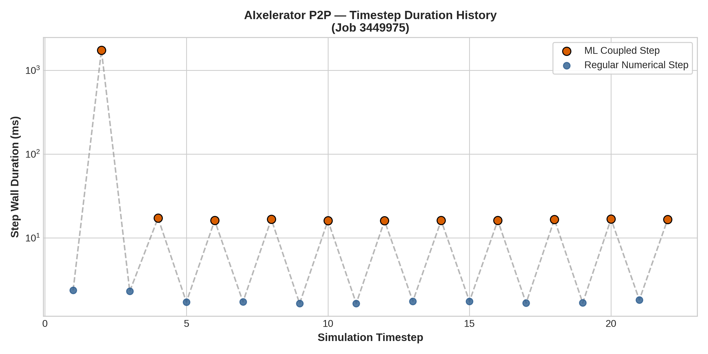
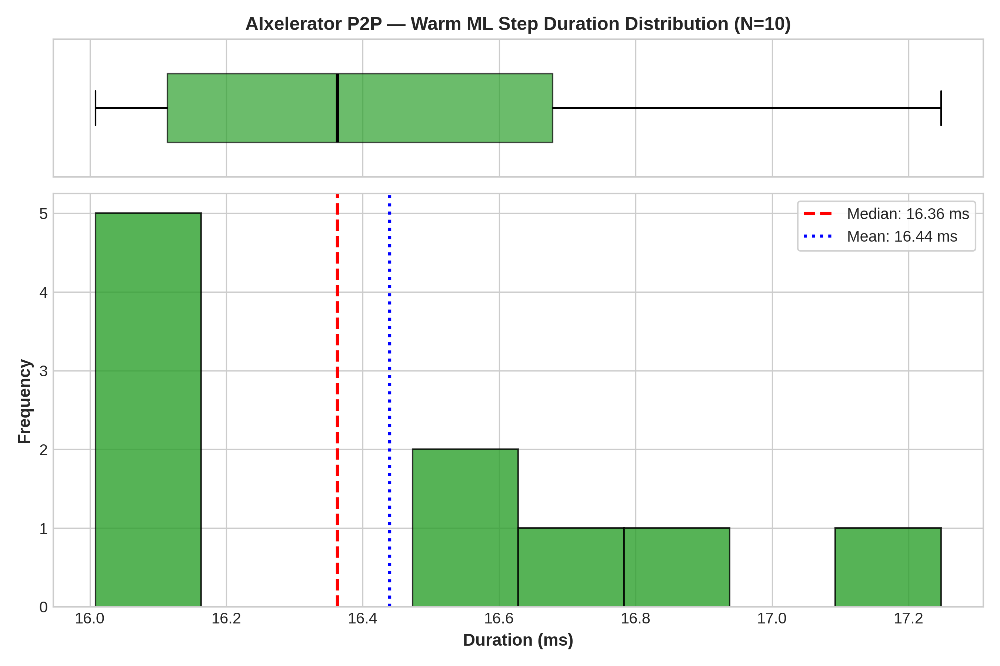
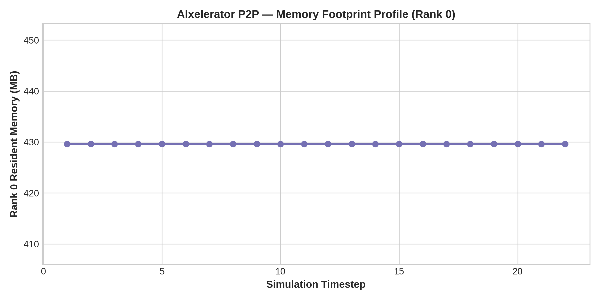

# Configuration Analysis: AIxelerator P2P

- **Framework / Provider**: `AIX`
- **Slurm Job ID**: `3449975`
- **Hardware Environment**: CLAIX-23 Heterogeneous (1x c23mm CPU Node with 24 Ranks + 1x c23g GPU Node with 1x NVIDIA H100)
- **Workload**: WaterCNN ($1920 \times 1080$, 22 timesteps)

## 1. Timestep Timing Statistics

| Metric | Duration (ms) |
|---|---|
| **Cold Start ML Step (Step 1)** | 1743.45 ms |
| **Warm ML Step Median** | **16.36 ms** |
| **Warm ML Step IQR** | 0.56 ms |
| **Warm ML Step Mean** | 16.44 ms |
| **Warm ML Step StdDev** | 0.41 ms |
| **Warm ML Step 95th Percentile** | 17.04 ms |
| **Regular Numerical Step Avg** | 1.82 ms |
| **Total Simulation Solve Time** | 5.0 s |

## 2. Resource Utilization

| Metric | Value |
|---|---|
| **Peak RSS (Max Rank)** | 1107.2 MB |
| **Peak RSS (Sum over Ranks)** | 10422.6 MB |
| **InfiniBand Traffic (ib0 RX / TX)** | 0.03 MB / 0.02 MB |

## 3. Performance Visualizations

### Timestep Progression (Cold Start vs Steady State)

### Warm Step Latency Distribution & Boxplot

### Memory Footprint Evolution

