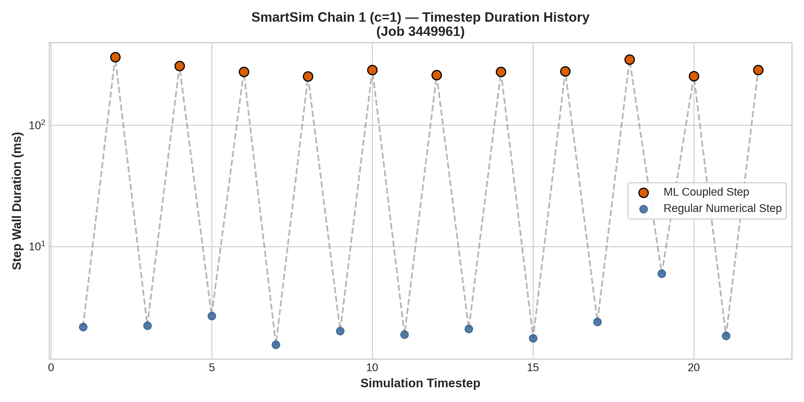
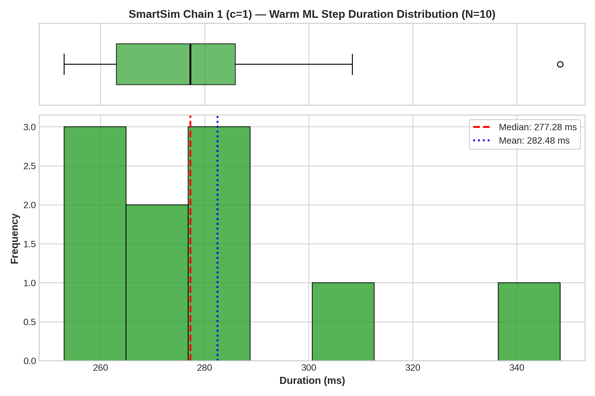
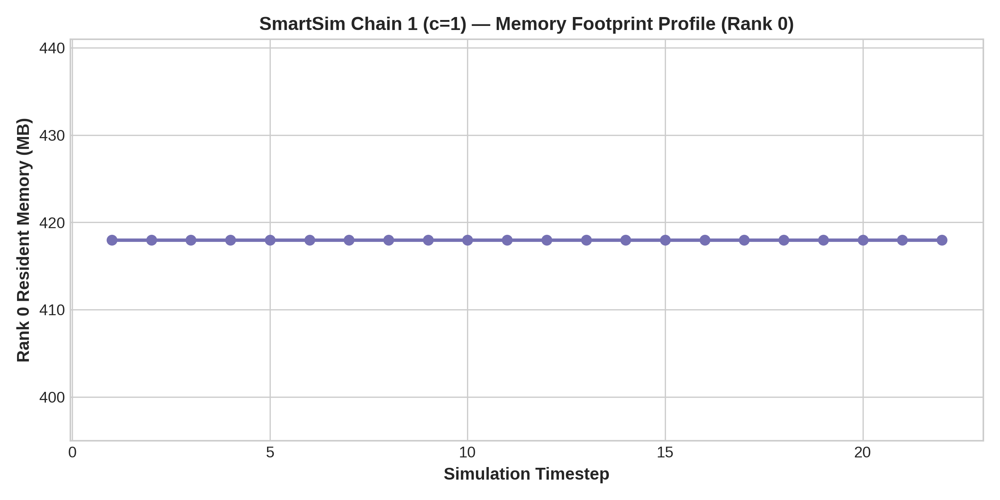

# Configuration Analysis: SmartSim Chain 1 (c=1)

- **Framework / Provider**: `SMARTSIM`
- **Slurm Job ID**: `3449961`
- **Hardware Environment**: CLAIX-23 Heterogeneous (1x c23mm CPU Node with 24 Ranks + 1x c23g GPU Node with 1x NVIDIA H100)
- **Workload**: WaterCNN ($1920 \times 1080$, 22 timesteps)

## 1. Timestep Timing Statistics

| Metric | Duration (ms) |
|---|---|
| **Cold Start ML Step (Step 1)** | 365.17 ms |
| **Warm ML Step Median** | **277.28 ms** |
| **Warm ML Step IQR** | 22.88 ms |
| **Warm ML Step Mean** | 282.48 ms |
| **Warm ML Step StdDev** | 28.59 ms |
| **Warm ML Step 95th Percentile** | 330.38 ms |
| **Regular Numerical Step Avg** | 2.41 ms |
| **Total Simulation Solve Time** | 28.0 s |

## 2. Resource Utilization

| Metric | Value |
|---|---|
| **Peak RSS (Max Rank)** | 418.0 MB |
| **Peak RSS (Sum over Ranks)** | 9526.5 MB |
| **InfiniBand Traffic (ib0 RX / TX)** | 93.39 MB / 1618.17 MB |

## 3. Performance Visualizations

### Timestep Progression (Cold Start vs Steady State)

### Warm Step Latency Distribution & Boxplot

### Memory Footprint Evolution

