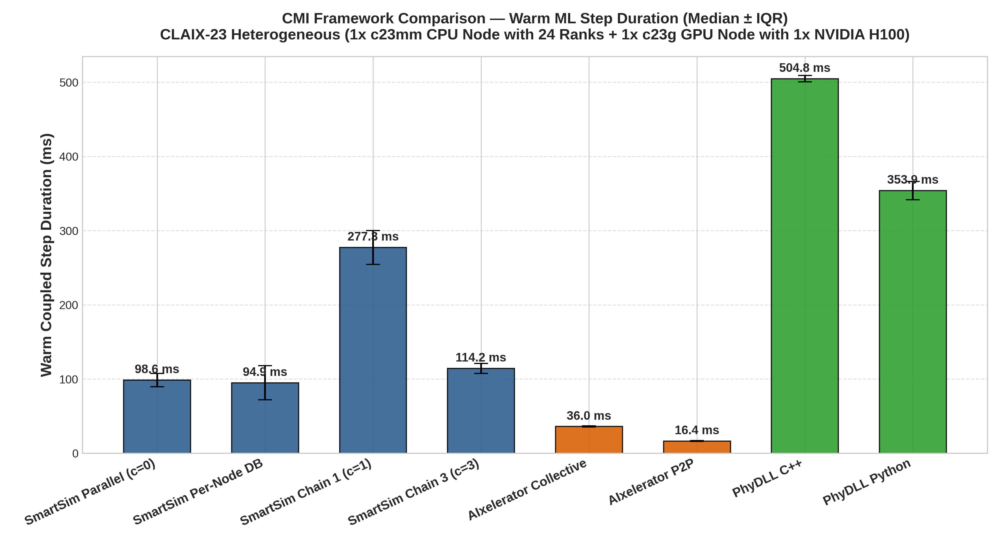
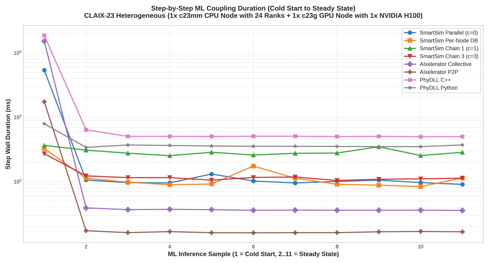

# CMI Multi-Framework Benchmark Report: 24-Rank Heterogeneous CPU/GPU Allocation

**Hardware Environment**: CLAIX-23 Heterogeneous (1x c23mm CPU Node with 24 Ranks + 1x c23g GPU Node with 1x NVIDIA H100)

**Workload**: WaterCNN 22 Timesteps (10 Warm ML Coupled Steps, 11 Regular Numerical Steps, 1 Initial Step) on 1920x1080 Grid.

## 1. Executive Performance Summary

| Job ID | Framework / Configuration | Warm Median (ms) | Warm IQR (ms) | Warm Mean (ms) | Warm StdDev (ms) | Cold Step (ms) | Total Solve Time (s) | Detailed Artifacts |
|---|---|---|---|---|---|---|---|---|
| 3449953 | **SmartSim Parallel (c=0)** | 98.57 | 8.91 | 101.97 | 11.30 | 5395.1 | 81.0 | [`../smartsim_c0/`](../smartsim_c0/config_summary.md) |
| 3449957 | **SmartSim Per-Node DB** | 94.88 | 22.96 | 105.55 | 26.71 | 327.2 | 26.0 | [`../smartsim_per_node_db/`](../smartsim_per_node_db/config_summary.md) |
| 3449961 | **SmartSim Chain 1 (c=1)** | 277.28 | 22.88 | 282.48 | 28.59 | 365.2 | 28.0 | [`../smartsim_c1/`](../smartsim_c1/config_summary.md) |
| 3449964 | **SmartSim Chain 3 (c=3)** | 114.20 | 6.78 | 112.94 | 5.79 | 271.4 | 26.0 | [`../smartsim_c3/`](../smartsim_c3/config_summary.md) |
| 3449970 | **AIxelerator Collective** | 36.03 | 0.82 | 36.47 | 0.99 | 15172.4 | 65.0 | [`../aix_collective/`](../aix_collective/config_summary.md) |
| 3449975 | **AIxelerator P2P** | 16.36 | 0.56 | 16.44 | 0.41 | 1743.5 | 5.0 | [`../aix_pipelined/`](../aix_pipelined/config_summary.md) |
| 3449978 | **PhyDLL C++** | 504.76 | 4.18 | 516.98 | 42.53 | 18678.4 | 66.0 | [`../phydll_cpp/`](../phydll_cpp/config_summary.md) |
| 3450422 | **PhyDLL Python** | 353.90 | 12.52 | 356.44 | 10.07 | 792.7 | 50.0 | [`../phydll_py/`](../phydll_py/config_summary.md) |

## 2. Memory Footprint Summary

| Configuration | Max Rank RSS (MB) | Aggregate Peak RSS (MB) |
|---|---|---|
| SmartSim Parallel (c=0) | 417.9 | 9505.0 |
| SmartSim Per-Node DB | 418.1 | 9527.2 |
| SmartSim Chain 1 (c=1) | 418.0 | 9526.5 |
| SmartSim Chain 3 (c=3) | 418.1 | 9524.9 |
| AIxelerator Collective | 1017.5 | 10483.6 |
| AIxelerator P2P | 1107.2 | 10422.6 |
| PhyDLL C++ | 319.2 | 7001.1 |
| PhyDLL Python | 318.5 | 6972.0 |

## 3. Key Observations

- **Fastest Warm Step**: `AIxelerator P2P` with **16.36 ms** per coupled step.
- **SmartSim Baseline (Parallel c=0)**: 98.57 ms.
- **AIxelerator P2P vs SmartSim c=0**: 6.02x speedup (16.36 ms vs 98.57 ms).
- **PhyDLL Python vs PhyDLL C++**: Python client achieved 353.90 ms vs C++ client 504.76 ms.

