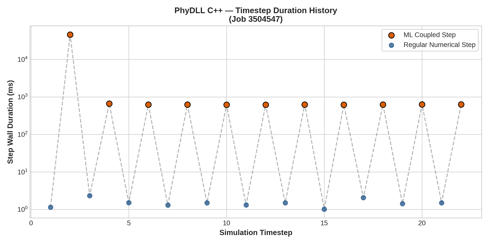
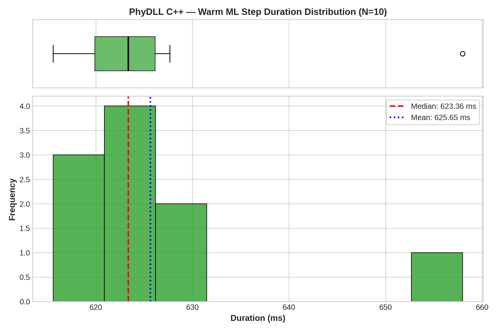
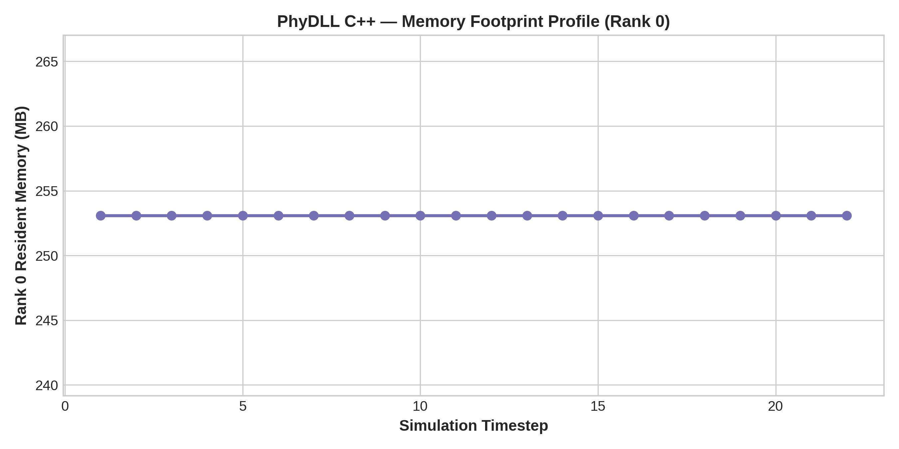

# Configuration Analysis: PhyDLL C++

- **Framework / Provider**: `PHYDLL`
- **Slurm Job ID**: `3504547`
- **Hardware Environment**: CLAIX-23 Single GPU Node (1x c23g Node with 96 CPU Cores, 1x NVIDIA H100 Active)
- **Workload**: WaterCNN ($1920 \times 1080$, 22 timesteps)

## 1. Timestep Timing Statistics

| Metric | Duration (ms) |
|---|---|
| **Cold Start ML Step (Step 1)** | 45596.70 ms |
| **Warm ML Step Median** | **623.36 ms** |
| **Warm ML Step IQR** | 6.25 ms |
| **Warm ML Step Mean** | 625.65 ms |
| **Warm ML Step StdDev** | 12.04 ms |
| **Warm ML Step 95th Percentile** | 644.34 ms |
| **Regular Numerical Step Avg** | 1.51 ms |
| **Total Simulation Solve Time** | 128.0 s |

## 2. Resource Utilization

| Metric | Value |
|---|---|
| **Peak RSS (Max Rank)** | 253.1 MB |
| **Peak RSS (Sum over Ranks)** | 21103.1 MB |
| **InfiniBand Traffic (ib0 RX / TX)** | 0.23 MB / 0.13 MB |

## 3. Performance Visualizations

### Timestep Progression (Cold Start vs Steady State)

### Warm Step Latency Distribution & Boxplot

### Memory Footprint Evolution

