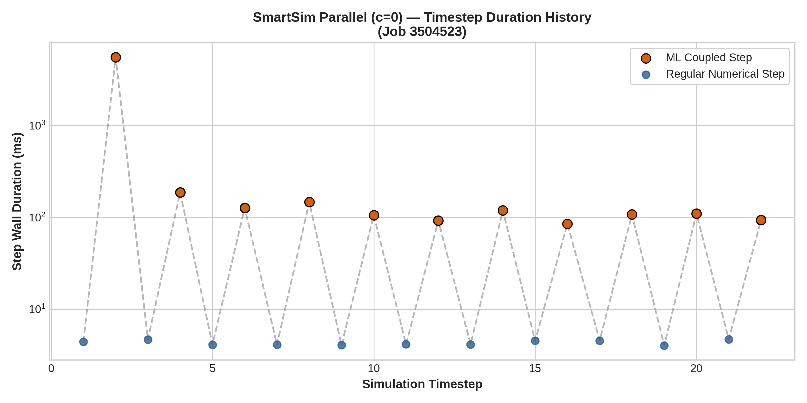
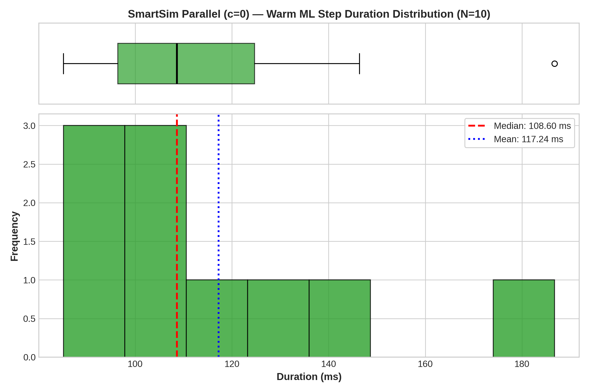
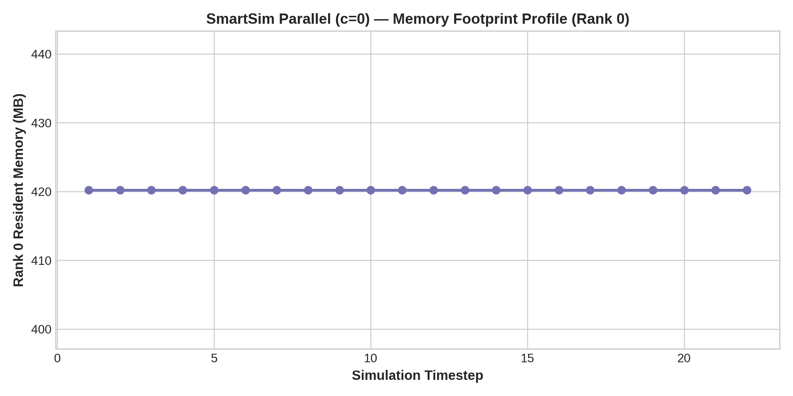

# Configuration Analysis: SmartSim Parallel (c=0)

- **Framework / Provider**: `SMARTSIM`
- **Slurm Job ID**: `3504523`
- **Hardware Environment**: CLAIX-23 Single GPU Node (1x c23g Node with 96 CPU Cores, 1x NVIDIA H100 Active)
- **Workload**: WaterCNN ($1920 \times 1080$, 22 timesteps)

## 1. Timestep Timing Statistics

| Metric | Duration (ms) |
|---|---|
| **Cold Start ML Step (Step 1)** | 5557.36 ms |
| **Warm ML Step Median** | **108.60 ms** |
| **Warm ML Step IQR** | 28.31 ms |
| **Warm ML Step Mean** | 117.24 ms |
| **Warm ML Step StdDev** | 30.33 ms |
| **Warm ML Step 95th Percentile** | 168.60 ms |
| **Regular Numerical Step Avg** | 4.31 ms |
| **Total Simulation Solve Time** | 114.0 s |

## 2. Resource Utilization

| Metric | Value |
|---|---|
| **Peak RSS (Max Rank)** | 420.2 MB |
| **Peak RSS (Sum over Ranks)** | 34921.3 MB |
| **InfiniBand Traffic (ib0 RX / TX)** | 403.06 MB / 1.26 MB |

## 3. Performance Visualizations

### Timestep Progression (Cold Start vs Steady State)

### Warm Step Latency Distribution & Boxplot

### Memory Footprint Evolution

