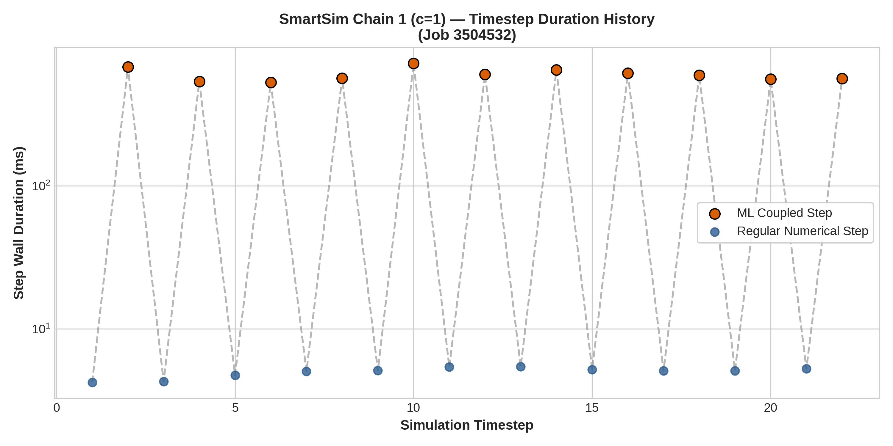
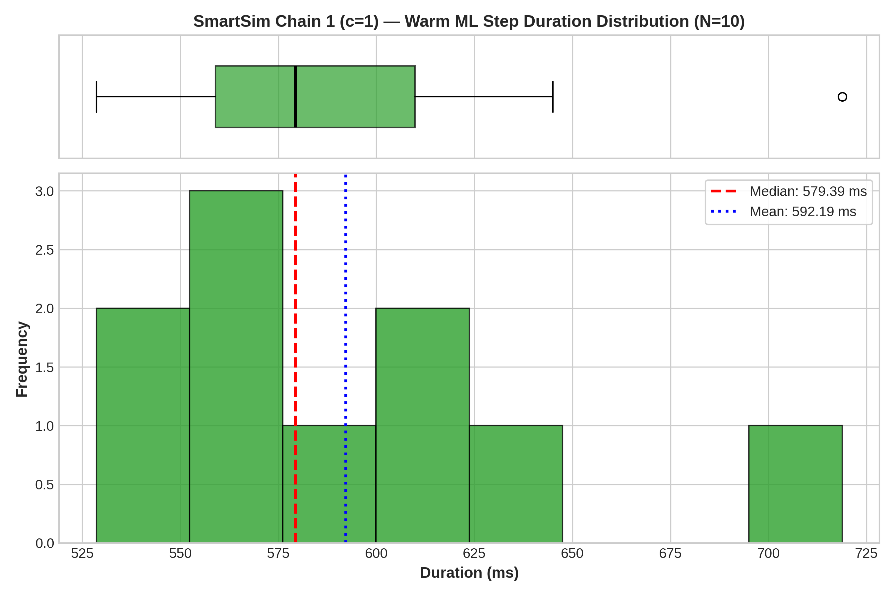
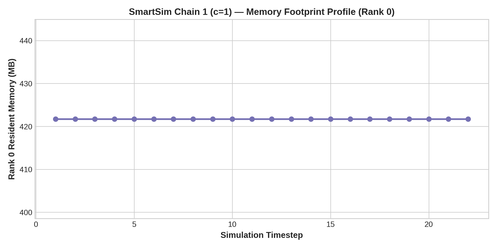

# Configuration Analysis: SmartSim Chain 1 (c=1)

- **Framework / Provider**: `SMARTSIM`
- **Slurm Job ID**: `3504532`
- **Hardware Environment**: CLAIX-23 Single GPU Node (1x c23g Node with 96 CPU Cores, 1x NVIDIA H100 Active)
- **Workload**: WaterCNN ($1920 \times 1080$, 22 timesteps)

## 1. Timestep Timing Statistics

| Metric | Duration (ms) |
|---|---|
| **Cold Start ML Step (Step 1)** | 678.33 ms |
| **Warm ML Step Median** | **579.39 ms** |
| **Warm ML Step IQR** | 50.88 ms |
| **Warm ML Step Mean** | 592.19 ms |
| **Warm ML Step StdDev** | 56.97 ms |
| **Warm ML Step 95th Percentile** | 685.58 ms |
| **Regular Numerical Step Avg** | 4.99 ms |
| **Total Simulation Solve Time** | 51.0 s |

## 2. Resource Utilization

| Metric | Value |
|---|---|
| **Peak RSS (Max Rank)** | 421.7 MB |
| **Peak RSS (Sum over Ranks)** | 35064.7 MB |
| **InfiniBand Traffic (ib0 RX / TX)** | 0.06 MB / 0.04 MB |

## 3. Performance Visualizations

### Timestep Progression (Cold Start vs Steady State)

### Warm Step Latency Distribution & Boxplot

### Memory Footprint Evolution

