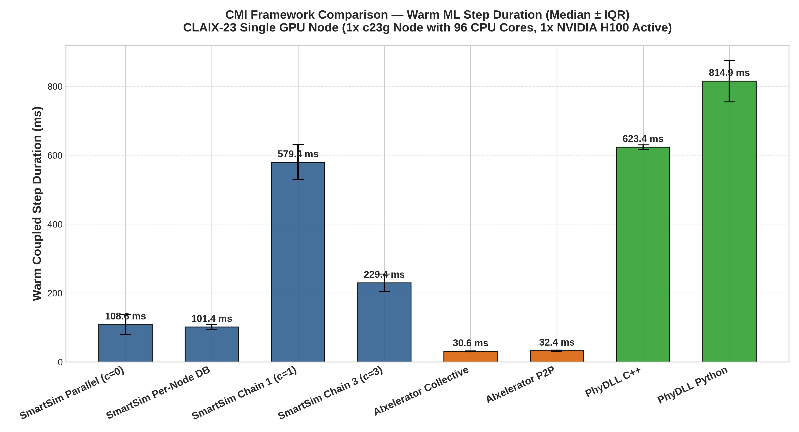
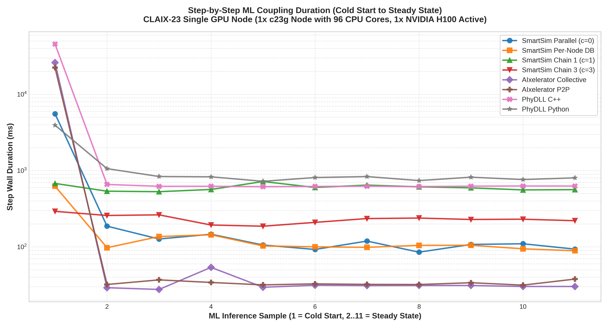

# CMI Multi-Framework Benchmark Report: 96-Core + 1-GPU Single Node Allocation

**Hardware Environment**: CLAIX-23 Single GPU Node (1x c23g Node with 96 CPU Cores, 1x NVIDIA H100 Active)

**Workload**: WaterCNN 22 Timesteps (10 Warm ML Coupled Steps, 11 Regular Numerical Steps, 1 Initial Step) on 1920x1080 Grid.

## 1. Executive Performance Summary

| Job ID | Framework / Configuration | Warm Median (ms) | Warm IQR (ms) | Warm Mean (ms) | Warm StdDev (ms) | Cold Step (ms) | Total Solve Time (s) | Detailed Artifacts |
|---|---|---|---|---|---|---|---|---|
| 3504523 | **SmartSim Parallel (c=0)** | 108.60 | 28.31 | 117.24 | 30.33 | 5557.4 | 114.0 | [`../smartsim_c0/`](../smartsim_c0/config_summary.md) |
| 3504529 | **SmartSim Per-Node DB** | 101.42 | 7.08 | 107.16 | 18.16 | 625.1 | 48.0 | [`../smartsim_per_node_db/`](../smartsim_per_node_db/config_summary.md) |
| 3504532 | **SmartSim Chain 1 (c=1)** | 579.39 | 50.88 | 592.19 | 56.97 | 678.3 | 51.0 | [`../smartsim_c1/`](../smartsim_c1/config_summary.md) |
| 3504535 | **SmartSim Chain 3 (c=3)** | 229.39 | 25.56 | 226.17 | 24.87 | 292.0 | 51.0 | [`../smartsim_c3/`](../smartsim_c3/config_summary.md) |
| 3504538 | **AIxelerator Collective** | 30.61 | 1.43 | 32.50 | 7.57 | 26089.4 | 108.0 | [`../aix_collective/`](../aix_collective/config_summary.md) |
| 3504541 | **AIxelerator P2P** | 32.42 | 2.00 | 33.47 | 2.21 | 22381.6 | 156.0 | [`../aix_pipelined/`](../aix_pipelined/config_summary.md) |
| 3504547 | **PhyDLL C++** | 623.36 | 6.25 | 625.65 | 12.04 | 45596.7 | 128.0 | [`../phydll_cpp/`](../phydll_cpp/config_summary.md) |
| 3504551 | **PhyDLL Python** | 814.88 | 60.18 | 821.78 | 92.94 | 3937.7 | 27.0 | [`../phydll_py/`](../phydll_py/config_summary.md) |

## 2. Memory Footprint Summary

| Configuration | Max Rank RSS (MB) | Aggregate Peak RSS (MB) |
|---|---|---|
| SmartSim Parallel (c=0) | 420.2 | 34921.3 |
| SmartSim Per-Node DB | 420.2 | 35052.6 |
| SmartSim Chain 1 (c=1) | 421.7 | 35064.7 |
| SmartSim Chain 3 (c=3) | 419.5 | 35064.4 |
| AIxelerator Collective | 913.6 | 37207.0 |
| AIxelerator P2P | 913.0 | 37047.4 |
| PhyDLL C++ | 253.1 | 21103.1 |
| PhyDLL Python | 297.4 | 25121.0 |

## 3. Key Observations

- **Fastest Warm Step**: `AIxelerator Collective` with **30.61 ms** per coupled step.
- **SmartSim Baseline (Parallel c=0)**: 108.60 ms.
- **AIxelerator P2P vs SmartSim c=0**: 3.35x speedup (32.42 ms vs 108.60 ms).
- **PhyDLL Python vs PhyDLL C++**: Python client achieved 814.88 ms vs C++ client 623.36 ms.

