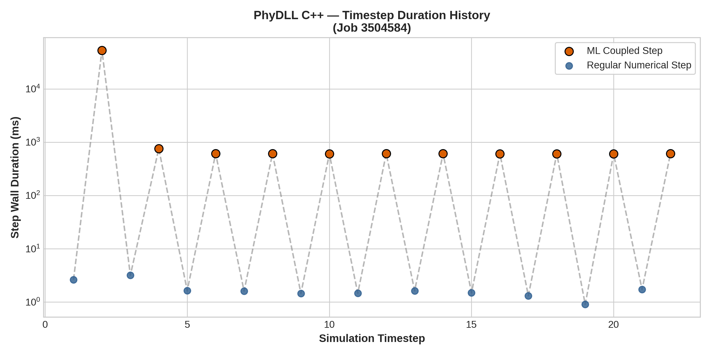
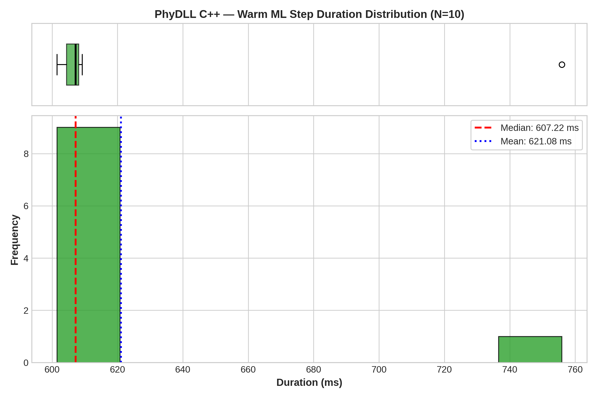
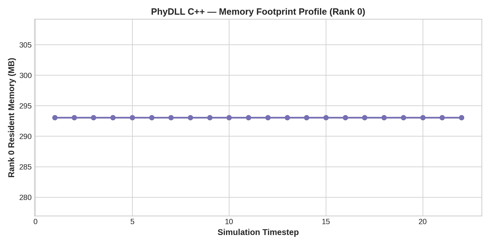

# Configuration Analysis: PhyDLL C++

- **Framework / Provider**: `PHYDLL`
- **Slurm Job ID**: `3504584`
- **Hardware Environment**: CLAIX-23 Single GPU Node (1x c23g Node with 96 CPU Cores + 4x NVIDIA H100 GPUs)
- **Workload**: WaterCNN ($1920 \times 1080$, 22 timesteps)

## 1. Timestep Timing Statistics

| Metric | Duration (ms) |
|---|---|
| **Cold Start ML Step (Step 1)** | 52787.80 ms |
| **Warm ML Step Median** | **607.22 ms** |
| **Warm ML Step IQR** | 3.73 ms |
| **Warm ML Step Mean** | 621.08 ms |
| **Warm ML Step StdDev** | 47.44 ms |
| **Warm ML Step 95th Percentile** | 689.91 ms |
| **Regular Numerical Step Avg** | 1.73 ms |
| **Total Simulation Solve Time** | 130.0 s |

## 2. Resource Utilization

| Metric | Value |
|---|---|
| **Peak RSS (Max Rank)** | 293.1 MB |
| **Peak RSS (Sum over Ranks)** | 24781.5 MB |
| **InfiniBand Traffic (ib0 RX / TX)** | 0.54 MB / 0.17 MB |

## 3. Performance Visualizations

### Timestep Progression (Cold Start vs Steady State)

### Warm Step Latency Distribution & Boxplot

### Memory Footprint Evolution

