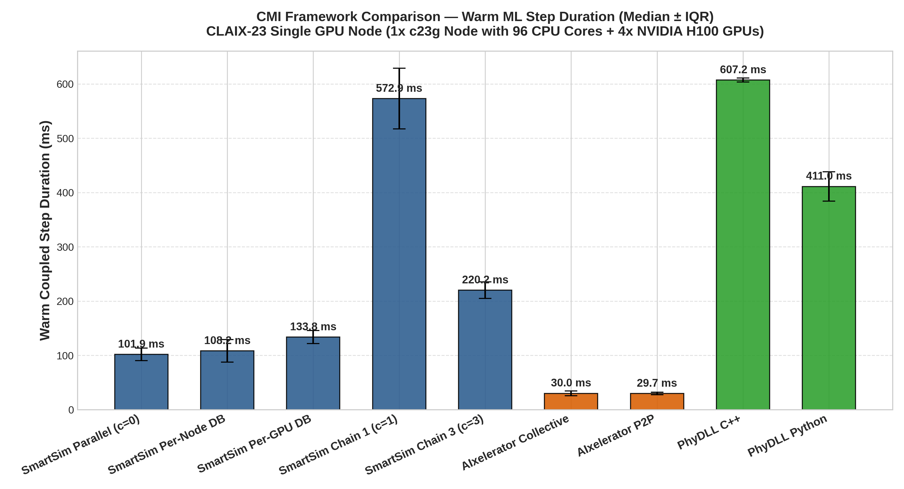
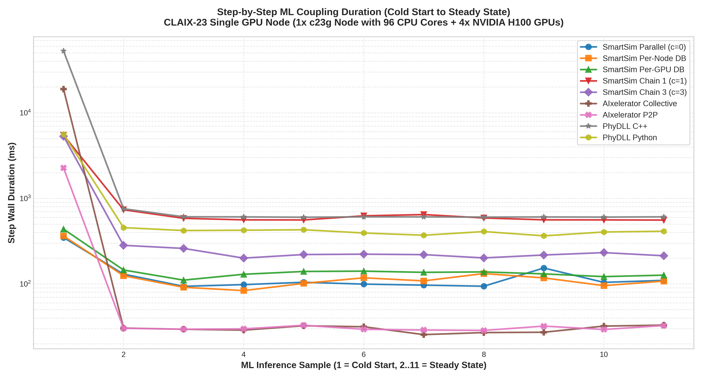

# CMI Multi-Framework Benchmark Report: 96-Core + 4-GPU Single Node Allocation

**Hardware Environment**: CLAIX-23 Single GPU Node (1x c23g Node with 96 CPU Cores + 4x NVIDIA H100 GPUs)

**Workload**: WaterCNN 22 Timesteps (10 Warm ML Coupled Steps, 11 Regular Numerical Steps, 1 Initial Step) on 1920x1080 Grid.

## 1. Executive Performance Summary

| Job ID | Framework / Configuration | Warm Median (ms) | Warm IQR (ms) | Warm Mean (ms) | Warm StdDev (ms) | Cold Step (ms) | Total Solve Time (s) | Detailed Artifacts |
|---|---|---|---|---|---|---|---|---|
| 3504561 | **SmartSim Parallel (c=0)** | 101.88 | 11.52 | 108.46 | 19.08 | 348.6 | 96.0 | [`../smartsim_c0/`](../smartsim_c0/config_summary.md) |
| 3504563 | **SmartSim Per-Node DB** | 108.24 | 20.86 | 108.06 | 15.35 | 363.7 | 48.0 | [`../smartsim_per_node_db/`](../smartsim_per_node_db/config_summary.md) |
| 3504565 | **SmartSim Per-GPU DB** | 133.79 | 12.00 | 132.09 | 10.40 | 437.5 | 89.0 | [`../smartsim_per_gpu_db/`](../smartsim_per_gpu_db/config_summary.md) |
| 3504567 | **SmartSim Chain 1 (c=1)** | 572.86 | 55.91 | 598.00 | 57.36 | 5475.1 | 113.0 | [`../smartsim_c1/`](../smartsim_c1/config_summary.md) |
| 3504573 | **SmartSim Chain 3 (c=3)** | 220.18 | 15.40 | 227.06 | 25.72 | 5316.2 | 111.0 | [`../smartsim_c3/`](../smartsim_c3/config_summary.md) |
| 3504577 | **AIxelerator Collective** | 30.00 | 4.35 | 29.78 | 2.57 | 18906.7 | 102.0 | [`../aix_collective/`](../aix_collective/config_summary.md) |
| 3504580 | **AIxelerator P2P** | 29.69 | 2.29 | 30.37 | 1.57 | 2264.2 | 78.0 | [`../aix_pipelined/`](../aix_pipelined/config_summary.md) |
| 3504584 | **PhyDLL C++** | 607.22 | 3.73 | 621.08 | 47.44 | 52787.8 | 130.0 | [`../phydll_cpp/`](../phydll_cpp/config_summary.md) |
| 3504590 | **PhyDLL Python** | 411.04 | 26.93 | 408.52 | 27.05 | 5620.4 | 19.0 | [`../phydll_py/`](../phydll_py/config_summary.md) |

## 2. Memory Footprint Summary

| Configuration | Max Rank RSS (MB) | Aggregate Peak RSS (MB) |
|---|---|---|
| SmartSim Parallel (c=0) | 418.7 | 34927.5 |
| SmartSim Per-Node DB | 420.2 | 35058.8 |
| SmartSim Per-GPU DB | 421.7 | 35061.0 |
| SmartSim Chain 1 (c=1) | 418.7 | 34919.6 |
| SmartSim Chain 3 (c=3) | 418.0 | 34922.0 |
| AIxelerator Collective | 913.2 | 37209.5 |
| AIxelerator P2P | 914.8 | 37183.0 |
| PhyDLL C++ | 293.1 | 24781.5 |
| PhyDLL Python | 286.6 | 24857.4 |

## 3. Key Observations

- **Fastest Warm Step**: `AIxelerator P2P` with **29.69 ms** per coupled step.
- **SmartSim Baseline (Parallel c=0)**: 101.88 ms.
- **AIxelerator P2P vs SmartSim c=0**: 3.43x speedup (29.69 ms vs 101.88 ms).
- **PhyDLL Python vs PhyDLL C++**: Python client achieved 411.04 ms vs C++ client 607.22 ms.

