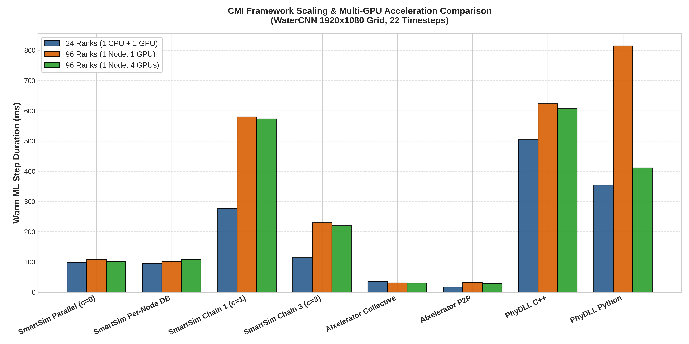

# CMI Cross-Hardware Scaling & GPU Acceleration Report

Comparison of CMI coupling frameworks across:
- **24 Ranks HetJob**: 1x `c23mm` CPU node (24 ranks) + 1x `c23g` GPU node (1x H100)
- **96 Ranks 1-GPU**: 1x `c23g` node (96 ranks, 1x H100 active)
- **96 Ranks 4-GPU**: 1x `c23g` node (96 ranks, 4x H100 active)

## 1. Summary Comparison Table (Warm Step Median Duration in ms)

| Framework / Configuration | 24 Ranks (1 CPU + 1 GPU) | 96 Ranks (1 Node, 1 GPU) | 96 Ranks (1 Node, 4 GPUs) |
|---|---|---|---|
| **SmartSim Parallel (c=0)** | 98.57 ms | 108.60 ms | 101.88 ms |
| **SmartSim Per-Node DB** | 94.88 ms | 101.42 ms | 108.24 ms |
| **SmartSim Chain 1 (c=1)** | 277.28 ms | 579.39 ms | 572.86 ms |
| **SmartSim Chain 3 (c=3)** | 114.20 ms | 229.39 ms | 220.18 ms |
| **AIxelerator Collective** | 36.03 ms | 30.61 ms | 30.00 ms |
| **AIxelerator P2P** | 16.36 ms | 32.42 ms | 29.69 ms |
| **PhyDLL C++** | 504.76 ms | 623.36 ms | 607.22 ms |
| **PhyDLL Python** | 353.90 ms | 814.88 ms | 411.04 ms |
| **SmartSim Per-GPU DB (4 DBs)** | — | — | 133.79 ms |

