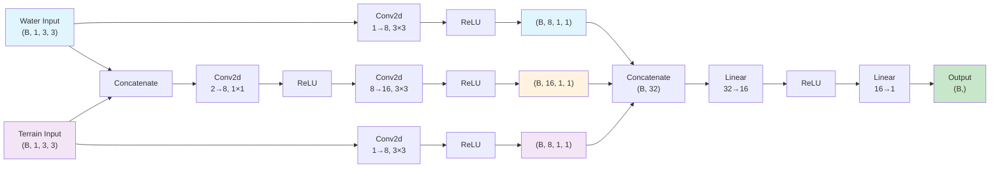

# WaterCNN Model Architecture

## Model Description

The **WaterCNN** model is a multi-branch convolutional neural network designed to predict water values at the next time step given 3×3 patches of water and terrain data.

### Architecture Details

**Input:**
- Water patches: (B, 1, 3, 3)
- Terrain patches: (B, 1, 3, 3)

**Three Processing Branches:**

1. **Water Branch** (Blue)
   - Conv2d(1→8, 3×3) → ReLU
   - Output: (B, 8, 1, 1)

2. **Terrain Branch** (Purple)
   - Conv2d(1→8, 3×3) → ReLU
   - Output: (B, 8, 1, 1)

3. **Combined Branch** (Orange)
   - Concatenate water & terrain → (B, 2, 3, 3)
   - Conv2d(2→8, 1×1) → ReLU → (B, 8, 3, 3)
   - Conv2d(8→16, 3×3) → ReLU → (B, 16, 1, 1)

**Head (Green):**
- Concatenate all three branches → (B, 32)
- Linear(32→16) → ReLU
- Linear(16→1)

**Output:** Single scalar value (B,)
